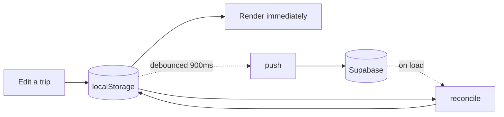
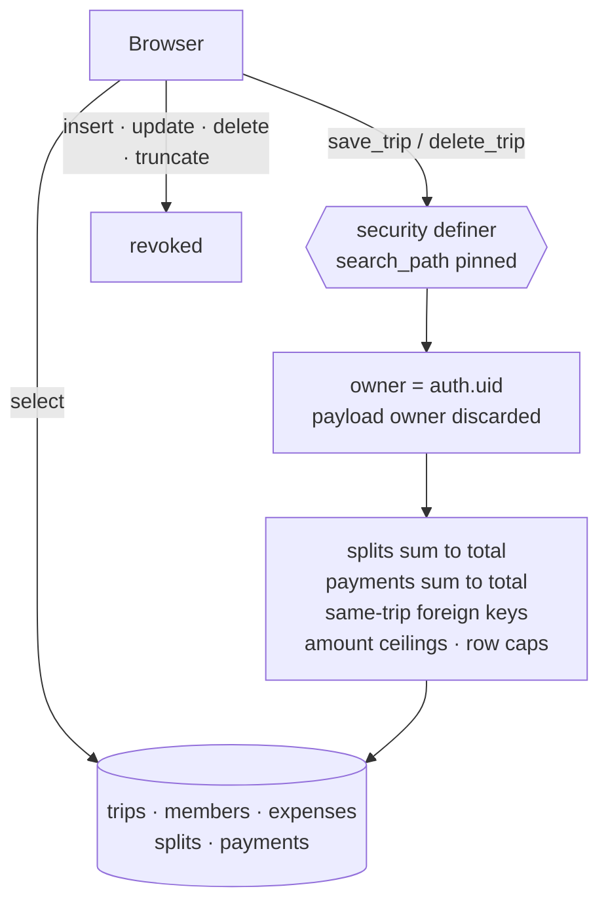

# Hisaab

Everyone paid for something. Nobody agrees on what. Hisaab works it out and
clears the whole group in the fewest payments possible, exact to the last
paisa.

A shared-expense tracker for trips, built for the part everyone dreads: the
settling up.

---

## What it looks like

```
  Hill trip, three nights                            4 people
  ──────────────────────────────────────────────────────────
  Hotel, two nights                                 8,600.00
      Rohan paid
  Night market food                                 2,400.00
      Asha and Rohan paid            [ split payment ]
  Cab to the fort                                   3,500.00
      Chetan paid
  Petrol                                            1,000.00
      Asha paid
  Breakfast, day two                                1,450.00
      Divya paid
  ══════════════════════════════════════════════════════════
  Total                                            16,950.00


  Settle up                                  three transfers
  ──────────────────────────────────────────────────────────
  Asha      ->  Rohan                               1,479.17
  Chetan    ->  Rohan                                 779.16
  Divya     ->  Rohan                               2,062.50
```

Four people, five expenses, one of them paid by two people at once. Twelve
possible debts collapse into three payments.

---

## What it does

| | |
|---|---|
| **Splits that add up** | Shares are worked out in paise and the odd remainder is handed out one at a time. `₹100 ÷ 3` is `33.34 + 33.33 + 33.33`, never `₹99.99`. Money is exact decimal end to end, never a float. |
| **Uneven splits** | Three ate the biryani, two didn't. Enter amounts by hand and the app says how far off the total you are, and in which direction, before accepting them. |
| **Several payers on one bill** | Two people put money in at the counter. Record both, and the ledger credits each. |
| **The fewest transfers** | Rather than everyone paying everyone, the trip collapses into the shortest list of payments that clears the group. |
| **People change mid-trip** | Someone leaves early? Redistribute their share across whoever remains, or keep the history exactly as recorded. Members are retired, never deleted, so their payments stay in the ledger. |
| **Your data leaves with you** | Export a trip to CSV or Excel, a row per person per expense, with a summary that reconciles. |
| **Works with no signal** | Runs entirely in the browser, installs to a phone home screen, opens on aeroplane mode. |

### The rounding, precisely

```
  ₹100.00 across three people

  in paise                    10000
  base share        ÷ 3        3333   each   ->   9999
  remainder                                          1   paisa
  handed out one at a time

  33.34   +   33.33   +   33.33   =   100.00
```

---

## How data is stored

Local-first. The browser holds the working copy; the cloud is a mirror.



- **Signed out**, trips live in `localStorage` and never leave the device.
- **Signed in**, every change is written locally first and pushed in the
  background. Nothing in the interface waits on the network.
- Each account gets its own storage key, so two people sharing a browser never
  see each other's trips, and signing out leaves the anonymous store untouched.
- Two devices editing one trip resolve by last write, compared on the server's
  timestamp rather than the client's.

The header always states where your data currently is, and changes when that
changes.

| State | What the header says |
|---|---|
| Signed out | Saved in this browser |
| Pushing | Saving |
| Settled | Synced to your account |
| No network | Offline. Your changes will sync when you reconnect |
| Rejected | Could not save, with a retry |
| Session gone | Your session expired, with a sign-in |

---

## Security

Row level security answers *may I touch this row?* It never answers *is this
row sane?* Both questions are answered in the database, so no client can skip
either.



- The five tables grant `select` and **nothing else**, not even `truncate`,
  which is exempt from row level security and would otherwise route around
  every check on this page.
- `save_trip` and `delete_trip` re-derive ownership from `auth.uid()`. Any
  owner in the payload is discarded, and writing into a trip you do not own
  raises.
- Splits and payments must sum to their expense's total, enforced by deferred
  constraint triggers so a whole trip is validated at commit.
- Composite foreign keys make a split referencing another trip's member
  structurally impossible.

`supabase/tests/hostile.sql` holds payloads a client could send and should
never succeed with. Run it after changing any migration: seven blocks must
fail, the eighth must succeed.

---

## Getting started

```bash
git clone https://github.com/tanishhhk/hisaab.git
cd hisaab
npm install
npm start
```

The app runs fully without a backend. Trips save to the browser, and sign-in is
hidden when Supabase is not configured.

### Optional: cloud sync

Copy `.env.example` to `.env` and fill in two values from **Project Settings →
API**:

```
REACT_APP_SUPABASE_URL=https://your-project.supabase.co
REACT_APP_SUPABASE_ANON_KEY=your-anon-public-key
```

Use the **anon public** key, never the `service_role` key. That one bypasses
every database rule. `.env` is gitignored.

Then apply the migrations, in order, in the Supabase SQL Editor:

| | File | What it does |
|---|---|---|
| 1 | `0001_init.sql` | Tables and row level security |
| 2 | `0002_sync.sql` | Invariants, payments, position, row caps |
| 3 | `0003_write_path.sql` | `save_trip` and `delete_trip` |
| 4 | `0004_close_remaining_grants.sql` | Locks the tables to read-only |
| 5 | `0005_per_entity_sync.sql` | Fine-grained per-entity synchronization |
| 6 | `0006_shared_trips.sql` | Shared trips, collaborative editing, and join codes |

Sign-in is a six digit code by email. No password to choose, forget, or reset.

### Custom SMTP is required, not optional

Supabase's built-in email sender cannot be used here, for two reasons: it locks
template editing, and the app needs a template change to work at all. The stock
templates send `{{ .ConfirmationURL }}`, a magic link, while Hisaab asks for the
six digits in `{{ .Token }}`. The built-in sender is also rate limited to a
handful of messages an hour and is not meant for production.

1. Connect a sender under **Project Settings → Authentication → SMTP Settings**.
   Resend suits a project with its own domain; Brevo allows a single verified
   address without one.
2. Editing then unlocks under **Authentication → Emails**. Change **both**
   *Confirm signup* and *Magic Link* to send the token:

   ```html
   <h2>Your Hisaab code</h2>
   <p style="font-size:32px;letter-spacing:8px;font-weight:700">{{ .Token }}</p>
   <p>Enter it in Hisaab to finish signing in. It expires in an hour.</p>
   ```

   Both, because `signInWithOtp` with `shouldCreateUser` sends *Confirm signup*
   to a new address and *Magic Link* to a returning one. Editing only the second
   works for existing accounts and fails for every new user.
3. Raise the email limit under **Authentication → Rate Limits**.

Clicking a link still works if one ever arrives: `detectSessionInUrl` is on, so
the token in the URL is honoured rather than silently ignored.

---

## Before going live

- [ ] All six migrations applied, in order.
- [ ] Grants verified. `authenticated` should hold `SELECT` and nothing else:

  ```sql
  select grantee, table_name, privilege_type
    from information_schema.role_table_grants
   where grantee in ('authenticated','anon','PUBLIC')
     and table_schema = 'public'
     and table_name in ('trips','members','expenses','splits','payments');
  ```

- [ ] `supabase/tests/hostile.sql` run. Seven blocks fail, the eighth succeeds.
- [ ] Custom SMTP connected, and **both** email templates switched to
  `{{ .Token }}`. Without this the built-in sender mails a magic link instead
  of the code the app asks for, and caps out after a few messages an hour.
- [ ] **Email confirmations on** under Authentication → Providers, and auth
  rate limits reviewed. The anon key is public by design, so these are what
  stop it being used to spam sign-ups.
- [ ] Signed in on a real device: create a trip, add a multi-payer expense,
  reload, and confirm the header reads *Synced to your account*.
- [ ] `GENERATE_SOURCEMAP=false` still set in `.env.production`, so the build
  ships no source maps.

---

## Testing

```bash
npm test -- --watchAll=false     # unit tests
npx tsc --noEmit                 # types
npm run build                    # production build
```

The suite runs with Supabase disabled via `.env.test`, so it is deterministic
and makes no network calls. The arithmetic (allocation, settlement, member
removal, row translation, conflict resolution) is pure and tested directly.

---

## Project structure

```
src/
├── App.tsx           App shell, trip and expense screens, settlement
├── Landing.tsx       Marketing page
├── SignIn.tsx        Email code auth
├── SyncStatus.tsx    The one line that says where your data is
├── supabase.ts       Client, deliberately nullable
└── sync/
    ├── ids.ts        uuid generation, legacy id migration, storage keys
    ├── rows.ts       Trip <-> database row translation
    ├── reconcile.ts  Merging local and remote copies
    ├── remote.ts     The only file that talks to Supabase
    └── useSync.ts    Debounce, retry, online/offline, status

supabase/
├── migrations/       Schema, applied in numeric order
└── tests/            Hostile-write checks
```

---

## Tech stack

React 19 · TypeScript · Tailwind CSS · Supabase (Postgres, Auth) · Framer
Motion · Lenis · SheetJS

---

## Roadmap

Native iOS and Android builds are planned, for the App Store and Google Play.
The web app is the reference implementation and will stay free.

---

## Author

Tanishk. [github.com/tanishhhk](https://github.com/tanishhhk)
